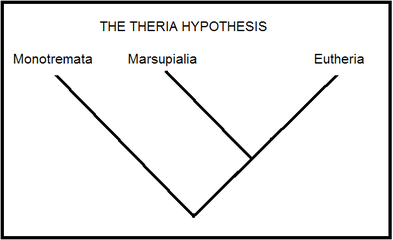
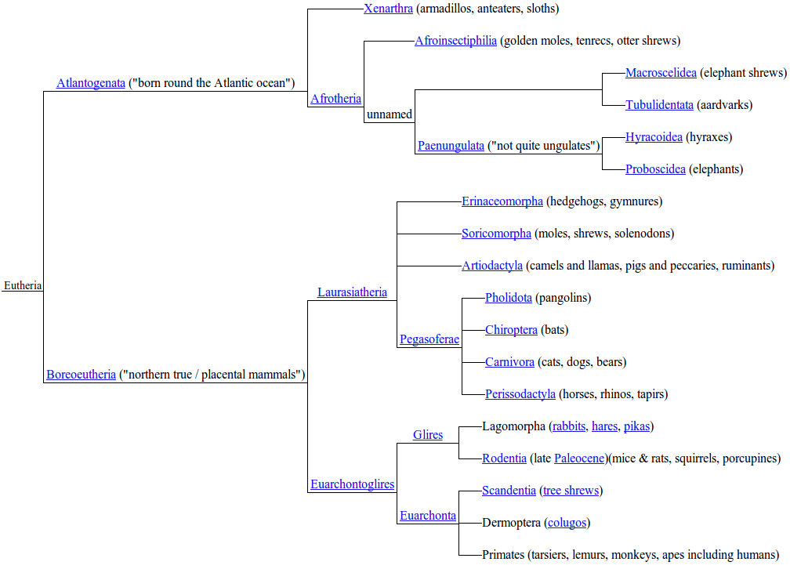

<link href="markdown.css" rel="stylesheet"></link>
## Homework 8

### Problem 1

You know what's awesome? Aquatic mammals. Seals, whales, manatees,
they have all the cool stuff that sets us mammals apart: mammary
glands, rockin' three-bone inner ear design, and a powerful
four-chambered heart, among other helpful innovations. But these guys
got tired of the grind of climbing trees, dealing with the sun, being
thirsty, and walking all the time. Legs aren't cool. You know what's
cool?  Flippers. Mammals need oxygen, can't breathe underwater, you
say? No bro, *you* can't breathe underwater because you lack
imagination. Aquatic mammals think outside the box. They say, jump in,
the water's just fine.

What we're going to do here is figure out how the aquatic mammals fit
in with the rest of the mammals. Did the aquatic mammals never come
out of the water in the first place, evolving from an aquatic
ancestor? Did they evolve from a single land mammal that decided to go
back into the water? Or, perhaps, did several distinct land mammals
independently decide they preferred to live at sea?

Let's do a little background on the history of mammals. The extant
mammals comprise three monophyletic groups: monotremes, marsupials,
and eutherians. There aren't that many monotremes, and my favorite
would be the duck-billed platypus. Marsupials you know and
love. Eutherians, that's the rest of us lot, the ones that have a
placenta. The most agreed-upon picture of the relationships between
these three groups is like so:

That is, the data suggest that the eutherians and the marsupials are
more closely related to one another than to the monotremes.

Then, there is quite a bit of diversity within the eutherians. Lots of
both bark and bite. Here's a clouds-level picture of the relationships
between the eutherians:

Ever wondered whether a dog is more closely related to a pig or a
horse? Or how the shrew and the elephant are related to the elephant
shrew? Boom.

I've hidden some stuff from this eutherian tree above. In particular,
there's no mention of our aquatic mammal friends. You're going to use
protein sequence data from the *cytochrome b* gene residing on the
mitochondrion to figure out where they go, and in the process, try to
answer the questions we had above about the history of the aquatic
mammals.

1. Make a FASTA-format file named like hw08_lastname.fasta that
   contains a number of cytochrome b **protein** sequences, as
   follows: grab one representative of each of the 12 terminal groups
   on the boreoeutherian clade. For instance, for "Carnivora" you
   might use a sequence from a grizzly bear or, being true to your
   school, a panther. For the atlantogenatan clade, just grab
   elephant, aardvark and armadillo. Then grab sequences for three
   aquatic mammals: the blue whale, the harbor seal, and the
   manatee. Then grab duck-billed platypus to use as an
   outgroup. There should thus be a total of 12 + 3 + 3 + 1 = 19
   sequences in your file. You'll probably want to modify the headers
   in the file to have just the organism's common name, in order to
   make the rest of the assignment easier. For example, this guy:

   >\>gi|5835120|ref|NP_007172.1|CYTB_10543 cytochrome b [Equus caballus]

   you'll probably want to replace with

   >\>Horse

   As a sanity check, the protein sequences should all be of roughly
   the same length. Use the web to help mapping an organism's common
   name into its latin binomial name.

   While you can certainly just search "this\_mammal cytochrome b" in
   NCBI or Ensembl to do this, there's a faster way. One way to speed
   things up is to use blastp. Grab one cytochrome b sequence,
   e.g. that panther's, and blast it against "refseq_protein",
   restricting to "Mammalia", and then tell blast to return 5000
   target sequences. When the results finally come back, click on
   "Taxonomy Report" to arrange the results by taxonomy. That should
   give you a screen full of hits that makes it easy to get cytochrome
   b sequences. Just click one of the links on the right of the page
   to get to the corresponding sequence's reference page.

   Include this FASTA file in your submission, please.

1. Align the sequences you gathered, and make a phylogenetic tree out
   of them. I'd recommend using EBI's MUSCLE server, because you can
   just use it online and it makes it easy to get a phylogenetic
   tree. Include the tree image in your writeup.

1. What do you find are the the most similar sequences, respectively,
   to your three aquatic mammals?

1. Based on your tree, do you think that aquatic mammals descend from
   a single land-based mammalian ancestor that went back into the
   water, or do you think that several distinct land-based mammals
   went back into the water independently? Explain.

1. Is your answer above definitive? If so, explain why. If not,
   explain what additional evidence you would seek in order to be more
   definitive (with respect to single/multiple origins of aquatic
   mammals).

1. Why is *cytochrome b* often used by molecular phylogeneticists?
   There are plenty of other genes, and there are plenty of other
   mitochondrial genes. Why do researchers use this one?

&nbsp;

&nbsp;

&nbsp;

&nbsp;

&nbsp;

### Problem 2

Consider the following distance matrix:

<table border="1" cellpadding="0" width="200" height="119">
   <tbody><tr>
      <td width="16%" height="17">
         
&nbsp;

      </td>
      <td width="16%" height="17">
         
&nbsp;A

      </td>
      <td width="17%" height="17">
         
&nbsp;B

      </td>
      <td width="17%" height="17">
         
&nbsp;C

      </td>
      <td width="17%" height="17">
         
&nbsp;D

      </td>
      <td width="17%" height="17">
         
&nbsp;E

      </td>
   </tr>
   <tr>
      <td width="16%" height="17">
         
&nbsp;B

      </td>
      <td width="16%" height="17">
         
&nbsp;5

      </td>
      <td width="17%" height="17">
         
&nbsp;

      </td>
      <td width="17%" height="17">
         
&nbsp;

      </td>
      <td width="17%" height="17">
         
&nbsp;

      </td>
      <td width="17%" height="17">
         
&nbsp;

      </td>
   </tr>
   <tr>
      <td width="16%" height="17">
         
&nbsp;C

      </td>
      <td width="16%" height="17">
         
&nbsp;4

      </td>
      <td width="17%" height="17">
         
&nbsp;7

      </td>
      <td width="17%" height="17">
         
&nbsp;

      </td>
      <td width="17%" height="17">
         
&nbsp;

      </td>
      <td width="17%" height="17">
         
&nbsp;

      </td>
   </tr>
   <tr>
      <td width="16%" height="17">
         
&nbsp;D

      </td>
      <td width="16%" height="17">
         
&nbsp;7

      </td>
      <td width="17%" height="17">
         
&nbsp;10

      </td>
      <td width="17%" height="17">
         
&nbsp;7

      </td>
      <td width="17%" height="17">
         
&nbsp;

      </td>
      <td width="17%" height="17">
         
&nbsp;

      </td>
   </tr>
   <tr>
      <td width="16%" height="17">
         
&nbsp;E

      </td>
      <td width="16%" height="17">
         
&nbsp;6

      </td>
      <td width="17%" height="17">
         
&nbsp;9

      </td>
      <td width="17%" height="17">
         
&nbsp;6

      </td>
      <td width="17%" height="17">
         
&nbsp;5

      </td>
      <td width="17%" height="17">
         
&nbsp;

      </td>
   </tr>
   <tr>
      <td width="16%" height="17">
         
&nbsp;F

      </td>
      <td width="16%" height="17">
         
&nbsp;8

      </td>
      <td width="17%" height="17">
         
&nbsp;11

      </td>
      <td width="17%" height="17">
         
&nbsp;8

      </td>
      <td width="17%" height="17">
         
&nbsp;9

      </td>
      <td width="17%" height="17">
         
&nbsp;8

      </td>
   </tr>
</tbody></table>

You're going to build a phylogenetic tree based on these distances
using two different methods: UPGMA and Neighbor-Joining (NJ). In
addition to the course slides, you might find
[these slides](https://www.cs.princeton.edu/~mona/Lecture/phylogeny-slides.pdf)
helpful.

You'll use the program `neighbor` from the `PHYLIP` package to build
the trees. Head to [this website](http://mobyle.pasteur.fr/), which
will allow you to run `neighbor` online. (You can also download it
easily if you want to run it locally.)

Once you're there, drill down to `phylogeny` > `distance` > `neighbor`
to get to the interface for the program. Paste in the distance data as
formatted in the included `distances.txt` file. Tell the site not to
email you, and click open the 'advanced options' button. The only
option you want to mess with under 'advanced options' is "Distance
method", where you can switch between NJ and UPGMA.

1. Build an NJ tree. Either by hand or on a computer, redraw the tree
   that the program finds, including the branch lengths. Be sure to
   correctly represent in your drawing whether the tree is rooted or
   not.

1. Build a UPGMA tree. Either by hand or on a computer, redraw the
   tree that the program finds, including the branch lengths. Be sure
   to correctly represent in your drawing whether the tree is rooted
   or not.

1. The two trees should be different, both in terms of topology and
   branch lengths. Which tree would you say better represents the
   distance data, and why?

1. What went wrong with the method that made the worse tree?
